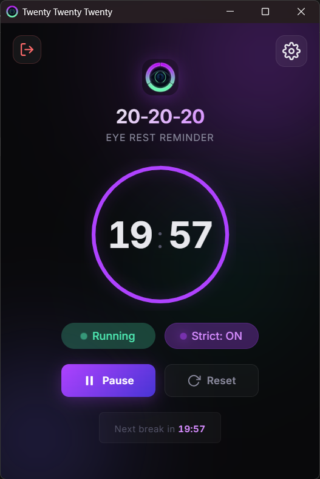

# Twenty Twenty Twenty

A lightweight desktop application that reminds you to rest your eyes following the **20-20-20 rule**: every 20 minutes, look at something 20 feet (6 meters) away for 20 seconds.

<p align="center">
  
</p>

## Features
- 🕒 **Customizable Intervals**: Adjust the work and break duration to fit your workflow.
- 🚀 **Extremely Lightweight**: Built with Rust and Tauri, minimizing RAM and CPU usage by aggressively destroying background windows.
- 🔒 **Strict Mode**: Optionally forces you to take a break by blocking the screen and disabling the close button.
- ⚙️ **System Tray Support**: Runs silently in the background and is easily accessible from the system tray.
- 🌙 **Modern UI**: Clean, glassmorphic design that runs smoothly even offline.

## Tech Stack
- **Framework:** [Tauri v2](https://v2.tauri.app/)
- **Backend:** Rust
- **Frontend:** TypeScript + Vanilla CSS + HTML (Vite)
- **Package Manager:** Bun

## Getting Started

### Prerequisites
- Install [Bun](https://bun.sh/)
- Install [Rust](https://www.rust-lang.org/tools/install)
- Follow Tauri's [prerequisites for your OS](https://v2.tauri.app/start/prerequisites/)

### Development
1. Clone the repository
2. Install dependencies:
   ```bash
   bun install
   ```
3. Run the app in development mode:
   ```bash
   bun run tauri dev
   ```

### Building for Production
To build an optimized, standalone executable for your operating system:
```bash
bun run tauri build
```

## License
MIT License
